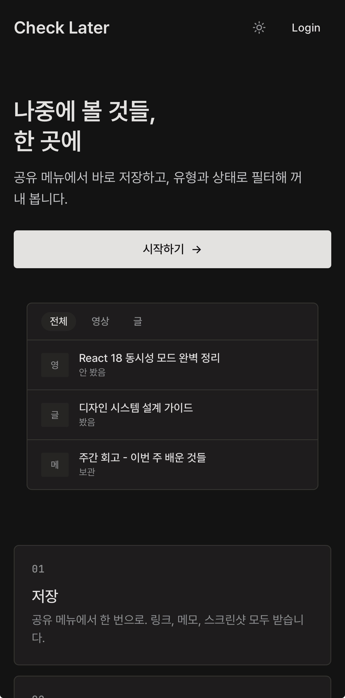
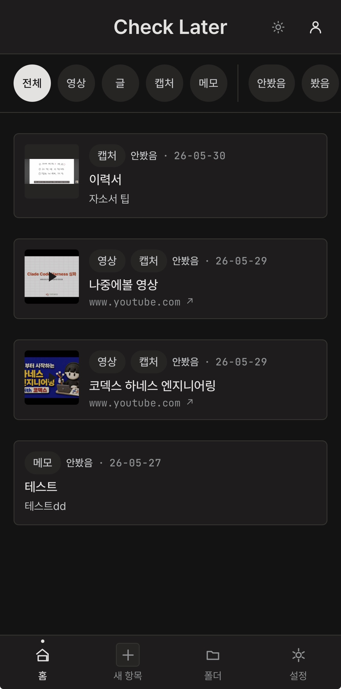
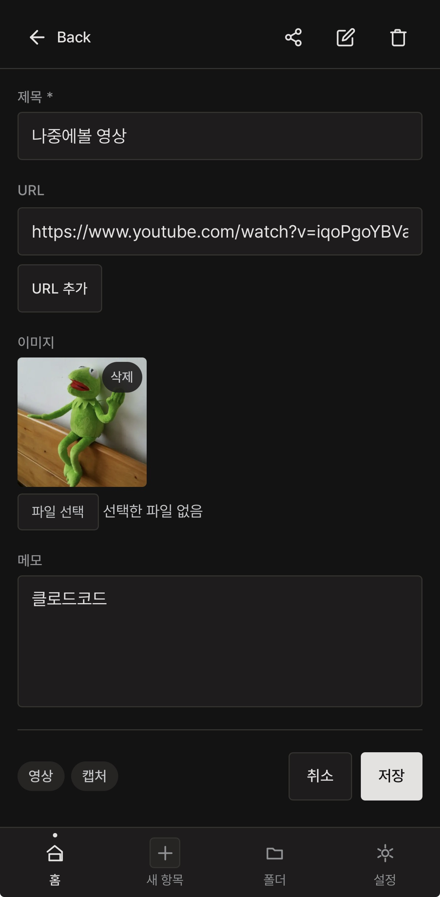
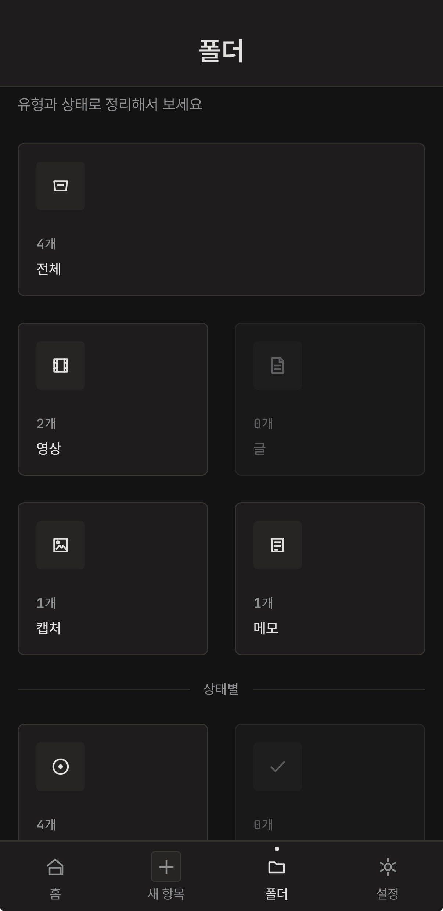

# Check Later

> "나중에 봐야지"를 실제로 다시 꺼내 볼 수 있게 — 카톡만큼 빠른 저장, 카톡에 없는 분류·조회.

영상 링크·글 URL·캡처 이미지·짧은 메모를 한 곳에 모아두고,  
**형태(영상/글/캡처/메모)와 상태(안 봄/봤음/보관) 두 축으로 필터링**해서 1주일 뒤에도 30초 안에 찾아볼 수 있는 **모바일 우선 PWA**.

홈 화면에 설치하면 네이티브 앱처럼 동작합니다 — 외부 앱 공유 메뉴에 바로 뜨고, 주소창 없이 전체 화면으로 실행됩니다.

**→ 배포 주소: [https://check-later.vercel.app](https://check-later.vercel.app)**  
**→ 레포지토리: [github.com/guiyoung2/check_later](https://github.com/guiyoung2/check_later)**

---

## 목차

- [모바일 앱으로 설치하기](#모바일-앱으로-설치하기)
- [프로젝트 배경](#프로젝트-배경)
- [핵심 기능](#핵심-기능)
- [기술 스택과 선택 이유](#기술-스택과-선택-이유)
- [주요 구현 포인트](#주요-구현-포인트)
- [성능 및 품질 지표](#성능-및-품질-지표)
- [아키텍처](#아키텍처)
- [로컬 실행](#로컬-실행)
- [개발 과정 기록](#개발-과정-기록)

---

## 모바일 앱으로 설치하기

PWA(Progressive Web App)로 제작되어 **홈 화면에 설치하면 앱스토어 없이 네이티브 앱과 동일한 UX**로 사용할 수 있습니다.

<div align="center">
  
  
  
  
</div>
<div align="center">
  <sub>랜딩 &nbsp;&nbsp;&nbsp;&nbsp;&nbsp;&nbsp;&nbsp;&nbsp;&nbsp;&nbsp;&nbsp;&nbsp;&nbsp;&nbsp;&nbsp;&nbsp;&nbsp;&nbsp; 메인 피드 &nbsp;&nbsp;&nbsp;&nbsp;&nbsp;&nbsp;&nbsp;&nbsp;&nbsp;&nbsp;&nbsp;&nbsp;&nbsp;&nbsp;&nbsp;&nbsp; 항목 저장 &nbsp;&nbsp;&nbsp;&nbsp;&nbsp;&nbsp;&nbsp;&nbsp;&nbsp;&nbsp;&nbsp;&nbsp;&nbsp;&nbsp;&nbsp;&nbsp; 폴더 뷰</sub>
</div>

### iOS (Safari)

1. Safari에서 **[check-later.vercel.app](https://check-later.vercel.app)** 접속
2. 하단 **공유 버튼** (□↑) 탭
3. **"홈 화면에 추가"** 선택
4. 이름 확인 후 오른쪽 위 **추가** 탭

### Android (Chrome)

1. Chrome에서 **[check-later.vercel.app](https://check-later.vercel.app)** 접속
2. 주소창 오른쪽 **설치 버튼** 탭 (또는 우상단 메뉴 → **앱 설치**)
3. **설치** 확인

> 설치 후 유튜브·크롬 등 외부 앱의 **공유 메뉴**에 Check Later가 나타납니다.  
> 탭 한 번으로 현재 앱을 떠나지 않고 바로 저장됩니다.

---

## 프로젝트 배경

**실제로 겪고 있는 문제**에서 출발했습니다.

| 상황 | 지금 하는 행동 | 문제 |
|---|---|---|
| "나중에 볼 영상" 발견 | 갤러리 캡처 | 다시 못 찾음 |
| 개발 팁 메모 | 카톡 나에게 보내기 | 검색은 되지만 분류가 없음 |
| 긴 글 정리 | Notion | 진입 마찰이 커서 "빠른 저장"엔 부적합 |

**핵심 가설**: 저장이 빠른 도구는 이미 있다(카톡). 부족한 건 "잘 찾아지는 구조"다.  
카톡만큼 빠른 저장 + 카톡에 없는 분류·조회를 동시에 충족하는 게 목표였습니다.

---

## 핵심 기능

### Web Share Target API — 외부 앱 "공유" 메뉴에서 1탭으로 저장
유튜브·크롬 등 외부 앱의 공유 메뉴에 **Check Later**가 나타납니다.  
탭 한 번으로 `/new?url=&title=&text=` 에 자동 진입, 확인 후 저장.  
디스코드 봇보다 탭 수가 적고, PWA 홈 화면 설치 시 네이티브 앱과 동일한 UX.

### 다중 첨부 — URL 여러 개 + 이미지 여러 장
- URL N개를 같은 항목에 묶어 저장 (관련 링크 모음)
- 이미지 다중 업로드 → 상세 페이지 swipe 슬라이더 (`scroll-snap` + `overflow-x-auto`)

### 타입 자동 판정
입력값 기반 우선순위로 카드 타입을 자동 결정:
```
YouTube URL → 영상 / 일반 URL → 글 / 이미지만 → 캡처 / 둘 다 없음 → 메모
```
폼 하단 칩으로 실시간 피드백, 저장 전 사용자가 변경 가능.

### 상태 관리 UX — 스와이프로 상태 전환
피드 카드에서 **왼→오른쪽 스와이프 80px** 이상이면 상태 순환 (`안 봄 → 봤음 → 보관 → 안 봄`).  
별도 버튼을 누르지 않고 손가락 제스처만으로 처리.

### 다크/라이트 모드 + 디자인 시스템
- CSS 변수 기반 토큰 시스템 (`oklch` 색상 공간 활용)
- Tailwind v4 `@theme inline`으로 토큰 통합
- `scripts/check-antipatterns.mjs`: 하드코딩 색상 (`#ffffff`, `bg-white` 등) 자동 감지 → **현재 위반 0건**

### 접근성 (WCAG AA 기준)
- 모든 인터랙티브 요소 **터치 타깃 ≥44px**
- 포커스 링, ARIA 레이블, 키보드 네비게이션 전수 검토
- 색 대비 WCAG AA 충족

---

## 기술 스택과 선택 이유

| 분류 | 선택 | 핵심 이유 |
|---|---|---|
| **UI** | React 19 | — |
| **빌드** | Vite 8 | `vite-plugin-pwa` 에코시스템, PWA/SW 설정 5분 안에 완료 |
| **언어** | TypeScript 6 | Supabase 자동 생성 타입으로 DB↔프론트 타입 정합성 보장 |
| **스타일** | Tailwind CSS v4 | `@theme inline`으로 CSS 변수 토큰과 유틸리티 클래스 통합 |
| **서버 상태** | TanStack Query v5 | 캐싱·낙관적 업데이트·리페치 자동 처리. Redux 대비 보일러플레이트 대폭 감소 |
| **UI 상태** | Zustand v5 | Provider 없이 어디서나 접근, 필터 상태 등 순수 클라이언트 상태 관리 |
| **백엔드** | Supabase | Postgres + Storage + Auth + RLS를 한 번에. Firebase 대비 복합 쿼리가 SQL로 직관적 |
| **PWA** | vite-plugin-pwa | Web Share Target manifest, SW 자동 생성 |
| **테스트** | Vitest v4 + Testing Library | Vite 동일 진영, ESM 네이티브, 설정 최소 |
| **배포** | Vercel | GitHub push → 자동 HTTPS 배포, PWA에 HTTPS 필수 |

**Next.js를 선택하지 않은 이유**: 백엔드를 Supabase에 위임하므로 SSR/서버 컴포넌트가 불필요. PWA는 본질적으로 CSR에 가깝고, Vite가 `vite-plugin-pwa`와의 통합이 더 단순합니다.

**Firebase를 선택하지 않은 이유**: Firestore(NoSQL)는 "형태 + 상태 + 날짜" 복합 필터에 복합 인덱스를 직접 구성해야 합니다. Supabase Postgres는 SQL 한 줄로 해결됩니다.

---

## 주요 구현 포인트

### 1. Signed URL 배치 발급 — N×2 API 호출 → 1번으로 최적화

**문제**: 이미지 N장이 있는 항목을 열 때마다 `getSignedUrl(path)` N번 + `list()`로 파일 존재 확인 N번 = **총 N×2번** API 호출이 발생했습니다.

**해결**: `createSignedUrls(paths[])` 배치 API로 **1번 호출**에 전부 처리.

```typescript
// Before: N장 × 2번 = 2N 호출
for (const path of paths) {
  await supabase.storage.from(BUCKET).list(folder, { search: filename });
  await supabase.storage.from(BUCKET).createSignedUrl(path, 3600);
}

// After: 1번 호출
const { data } = await supabase.storage
  .from(BUCKET)
  .createSignedUrls(paths, 3600);  // 배치 API
```

이미지가 10장인 항목 기준 **API 호출 20번 → 1번** 감소.

---

### 2. ItemForm 공용 컴포넌트 추출 — 코드 중복 제거

신규 작성(`NewItemPage`)과 수정(`ItemDetailPage`)이 각각 별도 폼 로직을 갖고 있었습니다.  
URL 정규화, 이미지 미리보기, og:title 자동 파싱 등 동일한 로직이 두 곳에 복제됐고, 버그 수정 시 두 파일을 동시에 고쳐야 했습니다.

`ItemForm` 공용 컴포넌트(`mode: 'create' | 'edit'`)로 추출 후:
- 폼 관련 고아 상태 5개, 고아 함수 5개 제거
- URL 정규화(`normalizeUrl`), YouTube 썸네일(`getYouTubeThumbnail`) 등 유틸 공용화
- 버그 수정 1곳만 수정하면 양쪽에 반영

---

### 3. URL 정규화 — `www.naver.com` 입력 시 프로토콜 자동 추가

**문제**: `www.naver.com` 입력 시 `^https?://` 패턴에 미매칭 → 타입이 '메모'로 판정, 저장 후 링크 클릭 시 `/items/www.naver.com`으로 상대경로 이동.

**해결**: `normalizeUrl` 유틸로 저장 전·폼 표시 전 양쪽에서 프로토콜 자동 보정.

```typescript
export function normalizeUrl(raw: string): string {
  const trimmed = raw.trim();
  if (!trimmed) return trimmed;
  if (/^https?:\/\//i.test(trimmed)) return trimmed;
  if (/^[\w-]+\.[\w.-]+/.test(trimmed)) return `https://${trimmed}`;
  return trimmed;
}
```

---

### 4. 타입 판정 우선순위 재설계

**이전**: 이미지 > URL (YouTube + 이미지 첨부 → 항상 '캡처'로 판정)

**변경**: URL > 이미지 (URL이 있으면 URL 기반으로 타입 결정, 이미지는 보조 칩으로 표시)

```typescript
// After
export function detectType({ url, hasImage }: DetectTypeParams): ItemType {
  const normalized = url?.trim();
  if (normalized) {
    if (/youtube\.com|youtu\.be/i.test(normalized)) return 'video';
    return 'article';
  }
  if (hasImage) return 'screenshot';
  return 'memo';
}
```

YouTube URL + 이미지 첨부 시: 피드 카드에 '영상' 칩 + '캡처' 칩 모두 표시.

---

### 5. CardMenu z-index 버그 — 드롭다운이 다음 카드 뒤로 숨는 문제

**원인**: 피드 목록의 각 카드 wrapper에 z-index가 없어, 열린 드롭다운이 카드 높이를 넘어가면 다음 카드 DOM이 그 위에 그려져 가려졌습니다.

**해결**: `menuOpen` state를 `ItemCard`에 추가, 드롭다운이 열릴 때만 wrapper에 `z-50` 적용.

```tsx
// ItemCard.tsx
const [menuOpen, setMenuOpen] = useState(false);
<div className={`group relative ${menuOpen ? 'z-50' : ''}`}>
  <CardMenu onOpenChange={setMenuOpen} />
</div>
```

불필요하게 항상 z-index를 높이지 않고, **열린 순간에만 조건부로 적용**해 레이아웃 영향 최소화.

---

## 성능 및 품질 지표

| 지표 | 수치 |
|---|---|
| **테스트** | 74개 전체 통과 (16개 파일, 0개 실패) |
| **빌드** | TypeScript 타입 에러 0건 (`tsc --noEmit` 포함) |
| **안티패턴** | 하드코딩 색상 위반 0건 (`check-antipatterns.mjs`) |
| **API 호출 최적화** | 이미지 N장 → signed URL 발급 N×2번 → 1번 (배치 처리) |
| **커밋** | 154개 (4개 Phase, 40+ Step 단위 구조화 개발) |
| **소스 파일** | 48개 (`.tsx`/`.ts`, 테스트 제외) |
| **접근성** | WCAG AA 기준, 터치 타깃 ≥44px, 키보드 네비게이션 |
| **PWA** | Lighthouse PWA 체크리스트 충족, 홈 화면 설치 가능 |

### Lighthouse 실측 (모바일 · 배포 환경)

`check-later.vercel.app`를 Lighthouse(모바일, CLI)로 측정한 결과입니다.

| 카테고리 | 점수 |
|---|---|
| Accessibility | **100** |
| Best Practices | **100** |
| Performance | 76 |
| SEO | 54 |

| Core Web Vitals | 값 | 평가 |
|---|---|---|
| CLS (누적 레이아웃 이동) | **0.002** | Good |
| TBT (총 차단 시간) | **0 ms** | Good |
| FCP (최초 콘텐츠 페인트) | 1.9 s | — |
| LCP (최대 콘텐츠 페인트) | 5.8 s | 개선 과제 |

### 번들 크기 (프로덕션 빌드)

| 자산 | Raw | Gzip |
|---|---|---|
| JS (`index`) | 543.88 kB | **152.93 kB** |
| CSS | 39.54 kB | **7.77 kB** |
| 초기 전송 합계 | — | **≈ 160.7 kB** |

> 165개 모듈, 단일 청크 구성. CSR 구조상 LCP(5.8s)는 메인 번들 파싱·실행 이후 콘텐츠가 렌더되는 데서 발생하며, **라우트 기반 코드 스플리팅을 다음 개선 과제로 식별**했습니다. CLS 0.002 · TBT 0 ms · Accessibility 100 · Best Practices 100은 레이아웃 안정성·메인 스레드 응답성·접근성 측면의 강점을 보여줍니다. SEO 54는 인증 기반 개인용 앱 특성상 우선순위가 낮은 항목입니다.

---

## 아키텍처

```
src/
 ├ pages/          라우트 컴포넌트 (6개 페이지)
 ├ components/
 │  ├ items/       카드 4종 (Article/Video/Memo/Image) + ItemForm 공용 폼
 │  └ ui/          디자인 시스템 원자 컴포넌트 (Button/Chip/Card/Toast/BottomSheet 등)
 ├ hooks/          TanStack Query 훅 (useItems, useItem, usePatchItem 등)
 ├ services/       Supabase 저장소 (itemsService, storageService, itemAttachmentsService)
 ├ stores/         Zustand (filterStore, themeStore)
 ├ lib/            유틸 (supabase client, normalizeUrl, youtube, form-type-detect, og-parser)
 └ types/          DB 생성 타입 + 도메인 타입
```

**데이터 흐름**:
```
사용자 액션
  → TanStack Query mutation (낙관적 업데이트)
  → Supabase PostgREST (Row Level Security 적용)
  → Postgres items 테이블
  → Query invalidation → UI 즉시 갱신
```

**보안 — Row Level Security**: 모든 DB 조작에 `user_id = auth.uid()` 조건이 DB 레벨에서 강제됩니다. 프론트에서 필터를 누락해도 다른 사용자 데이터가 노출되지 않습니다.

---

## 화면 구조

| 경로 | 화면 | 비고 |
|---|---|---|
| `/login` | Google OAuth 로그인 | |
| `/` | 메인 피드 | 형태·상태 필터 칩 + 카드 리스트 + FAB |
| `/new` | 새 항목 추가 | Web Share Target 진입점, URL/이미지/메모 다중 첨부 |
| `/items/:id` | 상세 보기 + 인라인 수정 | 이미지 슬라이더, 스와이프 상태 변경 |
| `/folders` | 타입×상태 카운트 그리드 | 클릭 시 홈 필터로 이동 |
| `/settings` | 테마 토글, 로그아웃, PWA 설치 안내 | |

---

## 로컬 실행

### 환경 변수

```bash
cp .env.example .env.local
```

```env
VITE_SUPABASE_URL=https://xxxxxxxxxxxx.supabase.co
VITE_SUPABASE_ANON_KEY=your-anon-key
```

### 명령어

```bash
npm install
npm run dev        # http://localhost:5173
npm run build      # 프로덕션 빌드 (tsc 포함)
npm run test       # 테스트 전체 실행
npm run lint
npm run format
```

### Supabase 테이블 설정

```sql
create table items (
  id          uuid primary key default gen_random_uuid(),
  user_id     uuid references auth.users not null,
  type        text check (type in ('video','article','screenshot','memo')) not null,
  status      text check (status in ('pending','reviewed','archived')) not null default 'pending',
  title       text not null,
  memo        text,
  url         text,
  image_path  text,
  attachments jsonb,
  created_at  timestamptz default now(),
  updated_at  timestamptz default now()
);

alter table items enable row level security;
create policy "개인 데이터만 접근" on items for all using (user_id = auth.uid());
```

---

## 개발 과정 기록

**Harness 프레임워크**로 전체 개발을 phase → step 단위로 설계·실행·검증했습니다.  
각 step은 자기완결적인 지시 파일로 작성되어 세션 간 맥락을 유지합니다.

| Phase | 기간 | 주요 작업 |
|---|---|---|
| `0-mvp` | 11 steps | 인증·CRUD·이미지 업로드·필터·PWA 초기 구현 |
| `1-ux-stabilization` | 4 steps | UX 안정화, 웹 공유 타겟 검증, 버그 수정 |
| `design-renewal` | 18 steps | UI 전면 개편 — 디자인 토큰, 원자 컴포넌트, 접근성, 다크모드, 안티패턴 가드 |
| `design-renewal-fix` | 9 steps | 랜딩 재설계, 테마 통합, `ItemForm` 공용 추출, 다중 첨부 |

Fix 이력(`fix/fix.md` ~ `fix6.md`)에는 각 버그의 **원인 분석 → 수정 계획 → 검증 게이트**가 명시되어 있습니다.
